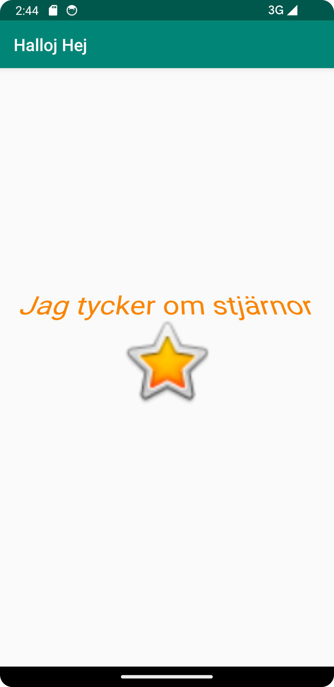

# Rapport
Det första jag gjorde var att ändra app-namnet, som gjordes genom att gå in på java > res > Values > Strings.xml, genom manipulation av kodraden: 

<string name="app_name">Halloj Hej</string>

Där "Halloj Hej" tidigare var namngivet hello. Därefter skapade jag ytterligare en String, som jag sedan skrivt in "Jag tycker om stjärnor" på.
Detta syns genom kodraden nedan.

<string name="Text_Insertion">Jag tycker om stjärnor</string>

som sedan används inom res > layout > activity_main.xml. Här utforskades de olika "vyerna", där ibland code-vyn som användes för att
sätta in den nyskapade Stringen, genom kodraden, för att få denna synlig i appen: 

android:text="@string/Text_Insertion"

Detta gav mig den text som syns i screenshotten som är bifogad i projektet. 

Ytterligare utforskade jag designviewn, 
där jag upptäckte möjligheten att lägga till bilder, via ImageView. Jag utforskade verktyget, där jag hittade en stjärn-png 
som jag slängde in i projectet för att se hur appen skulle reagera. Detta fungerade,  men jag insåg snabbt att en constraint behövdes användas 
på bilden (då jag jämförde TextViewn), vilket jag gjorde i designvyen via constraint-widgets default values som lades in när jag tryckte på den. 
Vid commit insåg jag att imageView behövde en contentDescription, vilket jag lade till i samma meny.

vid interaktion av TextView i design-vyn hittade jag även att man kunde ändra färg på texten, vilket även gjordes under common attributes. Ytteligare 
ändrade jag rotationen på texten via transforms. Jag ändrade även textApperance @style/TextAppearance.AppCompat.Display1, som också gjordes via common attributes - fliken.

